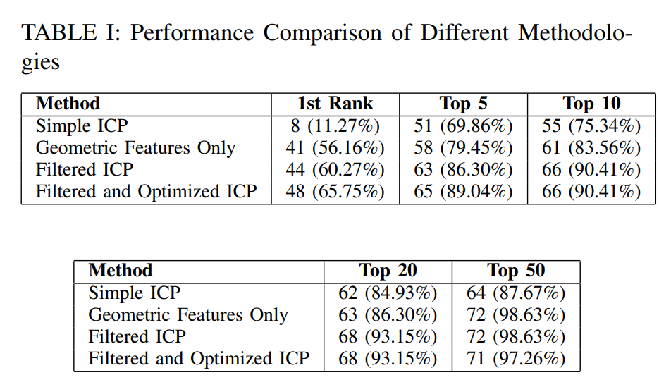

# Mesh and Point Cloud Similarity Assessment Algorithm

This repository contains a novel algorithm for robust and accurate similarity assessment between meshes and point clouds in 3D shape analysis. Our approach leverages a two-stage process:

## Dependencies

- Open3D
- Pandas
- GUDHI
- Trimesh
- PyVista
- Scikit-learn
- NumPy
- SciPy
- copy

The advent of 3D scanning technologies and the proliferation of 3D models in diverse applications—from cultural heritage preservation and virtual reality to medical imaging and industrial design—have underscored the critical need for advanced algorithms capable of analyzing and understanding the geometric and topological nuances of mesh and point cloud data. A fundamental challenge in this domain is the development of robust, accurate, and computationally efficient methods for assessing the similarity between 3D shapes. Such capabilities are vital for tasks such as object recognition, classification, and registration, as well as for facilitating operations like anomaly detection and digital twin modeling.

## Problem Statement

Traditional approaches to shape similarity have primarily focused on global descriptors or feature histograms that often fail to capture the intricate details and topological variations inherent in complex 3D structures. Moreover, the alignment and comparison of 3D shapes, especially those represented as meshes or point clouds, are further complicated by issues of scale, orientation, and the presence of noise and outliers.

## Solution Overview

In this repository, we introduce a novel algorithm that significantly advances the state-of-the-art in mesh and point cloud similarity detection. Our approach hinges on a comprehensive extraction of geometric features to establish an initial filter for potential matches, followed by a refined comparison using an Iterative Closest Point (ICP) method enhanced with Random Sample Consensus (RANSAC) for precision alignment and similarity assessment.

## Key Features

- Geometric Feature Extraction:
  - Oriented Bounding Box (OBB) dimensions
  - Betti numbers for topological complexity
  - Variance metrics from surface normals and triangle areas from the meshes of the model
  - Variance metrics from surface normals of the point clouds of the model (x,y,z variances)
  - Fast Point Feature Histograms (FPFH)
- Refined Alignment and Comparison:
  - Enhanced Iterative Closest Point (ICP) algorithm using Random Sample Consensus (RANSAC)
  - Using geometric features for parts (longer) for which RANSAC ICP fails.

## Usage

This repository provides an implementation of the described algorithm. Follow the instructions provided in the documentation to utilize the algorithm for mesh and point cloud similarity assessment in your projects.

## Results

The dataset used in our study comprised 73 uniquely labeled parts, each systematically compared against a larger collection of 1063 parts to assess the efficiency and accuracy of various similarity detection methodologies. These comparisons were conducted using four distinct approaches:

- **Simple ICP (Iterative Closest Point)**: This traditional method involves a brute-force application of ICP, comparing each of the 73 labeled parts against all 1063 parts in the dataset. The ICP algorithm aligns shapes by minimizing the distance between corresponding points, iteratively improving the fit to identify the best match. This exhaustive approach provides a baseline for similarity detection, though it can be computationally intensive.
  
- **Geometric Features Only**: In this method, we calculate Manhattan distances between geometric features of each part and those of the 1063 parts. The geometric features encompass various attributes like shape dimensions, surface textures, and topological signatures. Parts are then ranked based on the lowest Manhattan distance, prioritizing those with the most similar geometric characteristics.
  
- **Filtered Top 50 from Geometric Features for ICP**: To enhance efficiency, we first narrow down potential matches by selecting the top 50 parts based on their geometric similarity to each of the 73 labeled parts. ICP is then applied only to these filtered subsets, significantly reducing the computational load while still ensuring accurate similarity assessment.
  
- **Optimized for Longer Parts**: Some parts exhibit extended dimensions leading to an aspect ratio greater than 14, which complicates the ICP process due to potential misalignment and RANSAC convergence issues. For these parts, we modify our approach to bypass the ICP step entirely. Instead, similarity ranking is derived solely from the geometric features (Manhattan distances), thus avoiding the misalignments that ICP may introduce for such atypical parts.

These methods collectively represent a comprehensive suite of techniques for 3D shape similarity detection, each offering distinct advantages and tailored to specific challenges within the dataset. Through comparative analysis, we aim to identify the most effective and efficient strategies for various classes of parts, ultimately enhancing the robustness and applicability of our similarity detection framework.

### Results

The performance of each method is summarized in Table I, which shows the number and percentage of parts correctly identified at different ranking thresholds.

## License

This project is licensed under the MIT License - see the [LICENSE.md](LICENSE.md) file for details.

## Acknowledgments

- The works in this repository belongs to Dakik Yazilim LTD.
- numerical calculations reported in this article were partially performed at TUBITAK ULAKBIM, High-Performance and Grid Computing Center (TRUBA resources).
Mention any individuals, organizations, or resources that have contributed to the project.

